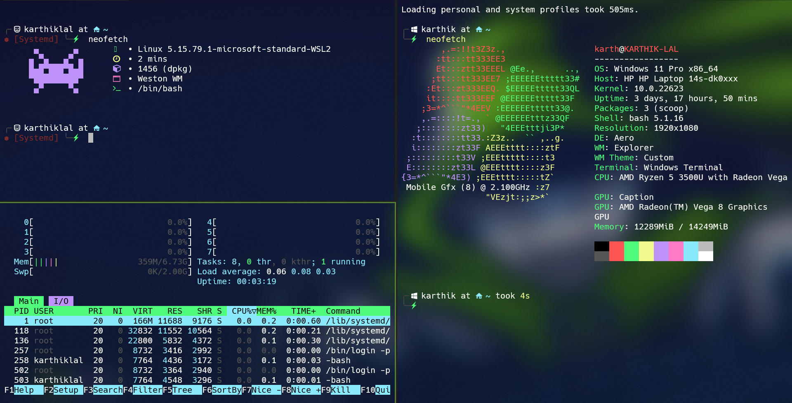

# **Windows and Linux Dotfile's🧑‍💻**

## **This dotfiles includes**

- PowerShell Config's
- Starship Prompt Config's
- NeoVim Config's
- Clink Config's
- Windows Terminal Config's
- Wsl Config's
- Neofetch Config's
- Terminator Config's

## **Download and setup configs**

- Download Powershell this PowerShell from [Microsoft Store](https://apps.microsoft.com/store/detail/powershell/9MZ1SNWT0N5D?hl=en-in&gl=in)
- Download and Setup Starship Prompt from [Starship Website](https://starship.rs/)
- Download and Setup NeoVim from [NeoVim Website](https://neovim.io/)
- Download Clink for setting up Starship prompt on CMD [Clink Website](https://chrisant996.github.io/clink/clink.html)
- Install neofetch on Linux using `sudo apt-get install neofetch` for Debian based Distros and `sudo pacman -S neofetch` for Arch Based Distros
- Install Terminator on Debian Based Linux using `sudo apt-get install terminator` for Arch based Linux use this `sudo pacman -S terminator`

## **Default Example locations for setting configs**

- PowerShell - `C:\Users\karth\OneDrive\Documents\PowerShell`
- Starship - `C:\Users\karth\.starship`
- NeoVim - `%LocalAppData%\nvim\`
- Clink - `%LocalAppData%\clink\`
- WindowsTerminal - `%LocalAppData%\Packages\Microsoft.WindowsTerminal_8wekyb3d8bbwe\LocalState`
- Wsl - `C:\Users\karth`
- Neofetch - `~/.config/neofetch` _[Linux]_
- Terminator - `~/.config/terminator` _[Linux]_
